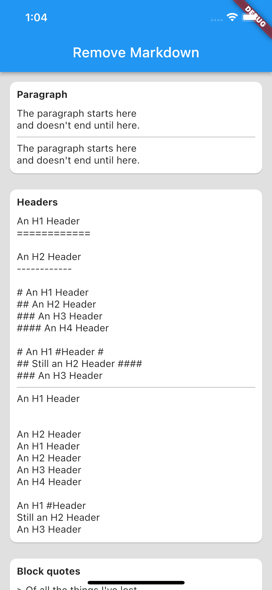

# Remove Markdown

This package is based on the idea of [remove-markdown](https://www.npmjs.com/package/remove-markdown) and is an attempt to implement this for dart projects.

## Usage

Import the library

```dart
import 'package:remove_markdown/remove_markdown.dart';
```

## Removing markdown

Remove markdown from a string:

```dart
const markdownString = '**Emphasis**';

// strip markdown off the string
// Result: Emphasis
print(markdownString.removeMarkdown());
```

## Supported markdown

List of currently supported markdown bits

Feature | Supported | Tested
---|---|---
Paragraphs | &#9745; | &#9745;
Links | &#9745; | &#9745;
Images | &#9745; | &#9745;
Lists | &#9745; | &#9745;
Code blocks | &#9745; | &#9745;
Inline code | &#9745; | &#9745;
Emphasis | &#9745; | &#9745;
Headers | &#9745; | &#9745;
HTML Tags | &#9745; | &#x2612;
Tables | &#x2612; | &#x2612;

## Example previews

| | | |
|--|--|--|
 |  | 
